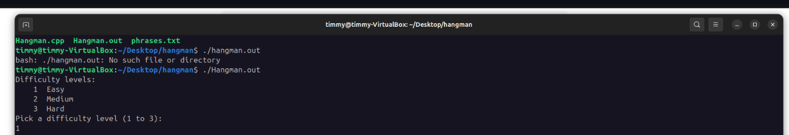
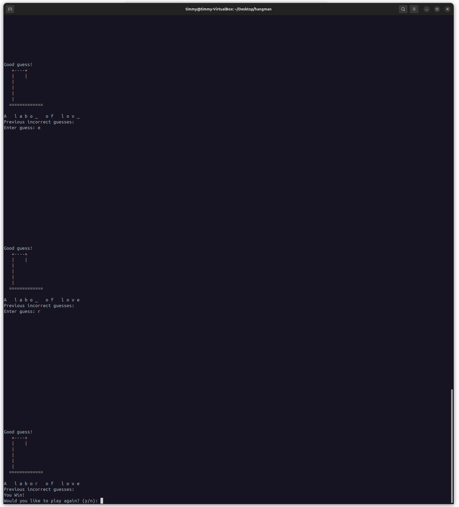
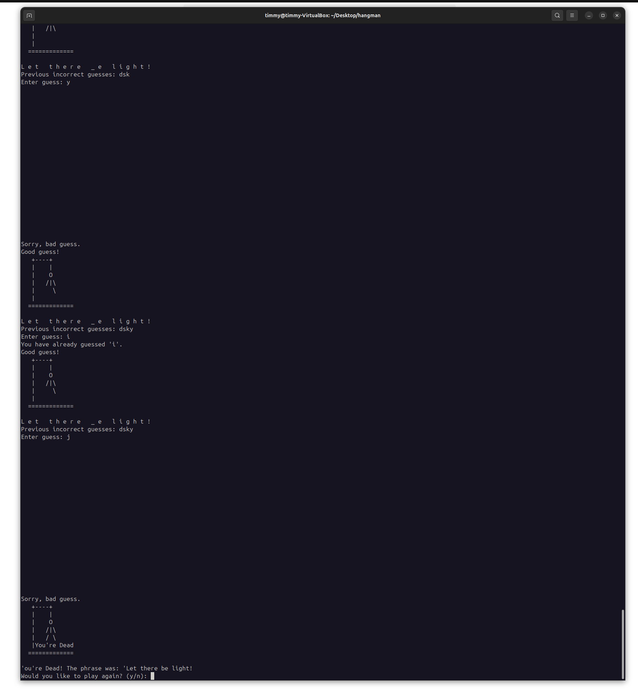
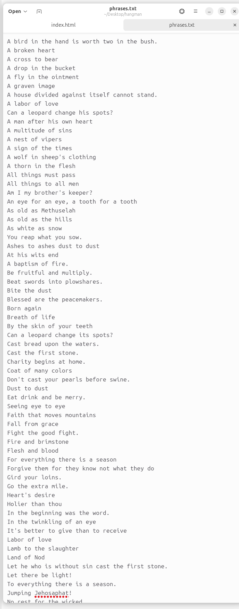

[Back to Portfolio](./)

Hangman Game
===============

-   **Class:** CSCI 325
-   **Grade:** B
-   **Language(s):** C++
- **Source Code Repository:** [Hangman Project](https://github.com/Metalmilitia26/hangman-project)

    (Please [email me](mailto:TAJenkins@student.csuniv.edu?subject=GitHub%20Access) to request access.)

## Project description

This project is a classic Hangman word-guessing game written in C++.  
The program reads phrases from a file, selects a random phrase based on the difficulty level,  
and allows the player to guess letters until they either solve the phrase or make five incorrect guesses.

As the player guesses incorrectly, the ASCII hangman drawing is updated step-by-step.  
The game also prevents repeated guesses, displays the puzzle with blanks and revealed letters,  
validates input, and determines win or loss conditions.

This project was completed using starter code provided by Dr. Hayes, and additional logic  
and features were implemented by **Timmy Jenkins**.

## How to compile and run the program

```bash
g++ Hangman.cpp -o Hangman.out
./Hangman.out
```

## UI Design

The Hangman program runs in the terminal and uses simple text-based interaction. The user selects a difficulty level, views the gallows drawing, and enters letter guesses one at a time. After each guess, the game updates the display by showing:

The current state of the gallows.

Correctly revealed letters in the phrase.

A list of previous incorrect guesses.

Win or loss messages when the game concludes.

This interface makes it easy for the user to follow progress, understand mistakes, and visually see the hangman form as misses accumulate.

  
Fig 1. The game starts and asks what difficulty you want to play on. 

  
Fig 2. This screenshot shows the operation and completion of the game, as well as the winning message. 

  
Fig 3. This screenshot shows what happens when you guess the wrong letters too many times. 

  
Fig 4. This is the list of phrases that the game looks for to play. 

## 3. Additional Considerations

- Phrases are loaded dynamically from the phrases.txt file.

- Difficulty (Easy, Medium, Hard) is based on the number of unique letters in the phrase.

- The hangman figure updates with each incorrect guess.

- The program demonstrates modular design, text processing, randomization, and user interaction.

[Back to Portfolio](./)
