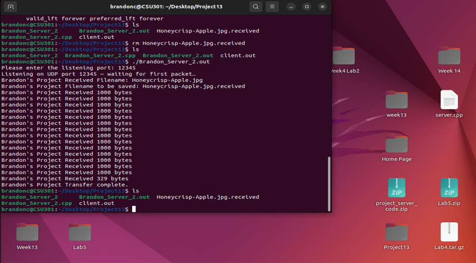

[Back to Portfolio](./)

Air Drop
===============

-   **Class:** CSCI 332
-   **Grade:** 100
-   **Language(s):** C++
- **Source Code Repository:** [Air Drop Project](https://github.com/Metalmilitia26/airdrop-project)

    (Please [email me](mailto:TAJenkins@student.csuniv.edu?subject=GitHub%20Access) to request access.)

## Project description

This project was a partner-based assignment where we created a client/server application in C++.  
I wrote the client side of the program, and my partner, Brandon Cooper, wrote the server side.  
Both the client and server files are included in the repository so the full system can run as intended.

The Air Drop program works by allowing the client to send data to the server, which processes and returns a response. 
In this case, we sent a picture of a "Honey Crisp apple". 
This assignment helped reinforce concepts such as networking, sockets, communication protocols, and teamwork in software development.

## How to run the program

This project was executed on an Ubuntu virtual machine using precompiled `.out` executable files.  
No compilation was required to run the program. The class used Visual Studio Code along with additional C++ extensions to compile the code beforehand. 

To start the server:

    ./Brandon_Server_2.out

To start the Client:

    ./Timmyclient.out

Make sure the server is running **BEFORE** launching the client.

## UI Design

This program runs entirely through a command-line interface on Ubuntu.  
The user interacts with the client by entering data through the terminal, while the server processes incoming requests and returns responses.

There is no graphical interface.  
All input and output occur through text-based commands in two separate terminal windows — one for the server and one for the client.

## Screenshots

  
Fig 1. Server-side code execution. The Honeycrisp-Apple is received at the end of the program. 

  
Fig 2. Client-side code execution.

  
Fig 3. This is the file that was transferred. 

## 3. Additional Considerations

This project was a valuable introduction to basic networking concepts, client/server communication, and teamwork in software development. Working with a partner reinforced the importance of coordinating responsibilities, testing both sides of the system, and ensuring compatibility between the client and server programs.

The experience also provided practical exposure to running compiled programs in a virtual Ubuntu environment and managing multiple terminal windows during execution.

[Back to Portfolio](./)
